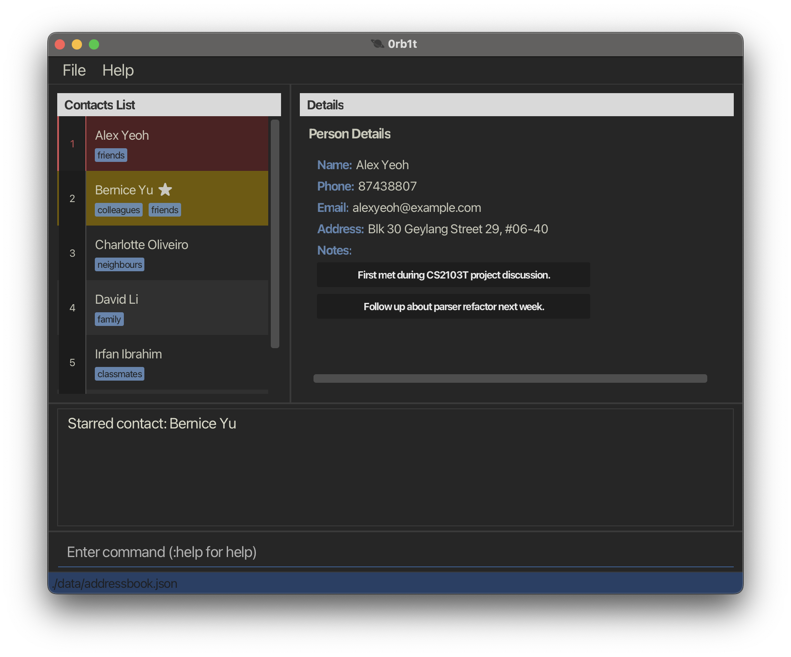

   
  

- **0rb1t** is a desktop application designed for developers who prefer keyboard-driven workflows.
  - It brings a **Vim-inspired interface** to contact and task management, so you never have to reach for the mouse.
  - Built for developers who feel at home in Vim: 0rb1t lets you navigate, edit, and manage with the keybindings you already know.
- The app is **written in OOP fashion**, based on a ~6 KLoC codebase with solid user and developer documentation.
- For detailed documentation, see the **[0rb1t Product Website](https://ay2526s2-cs2103t-t15-4.github.io/tp/)**.
- This project is based on the AddressBook-Level3 project created by the [SE-EDU initiative](https://se-education.org).
