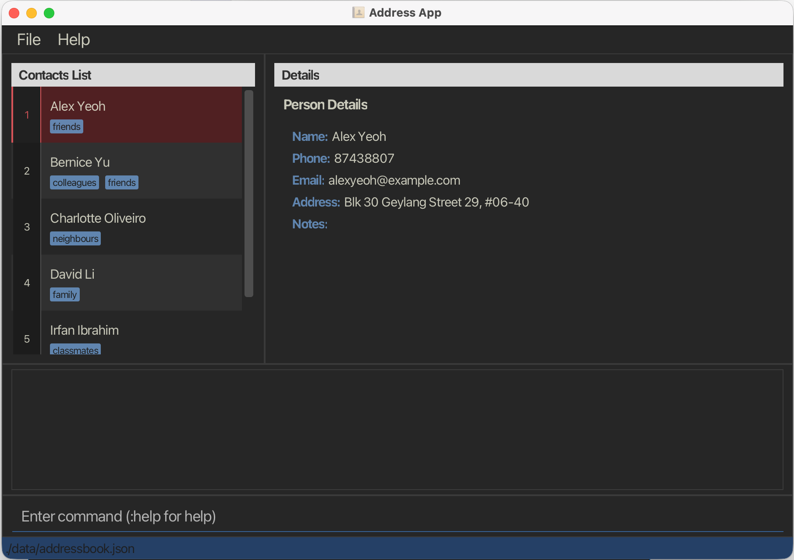
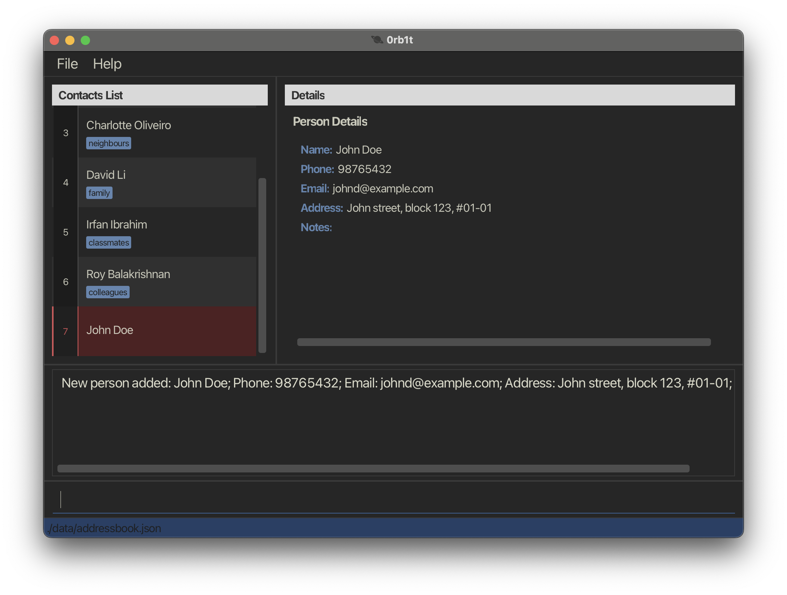
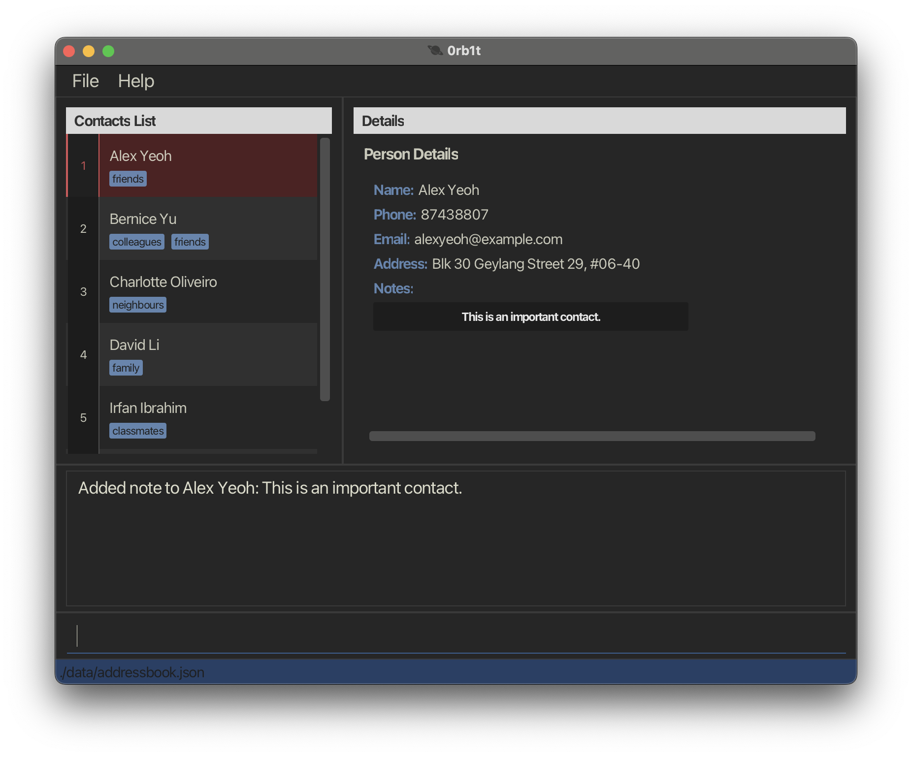
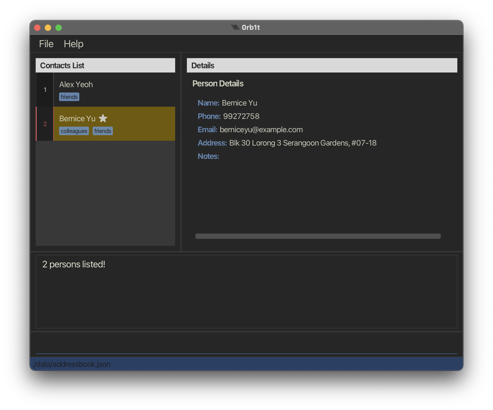
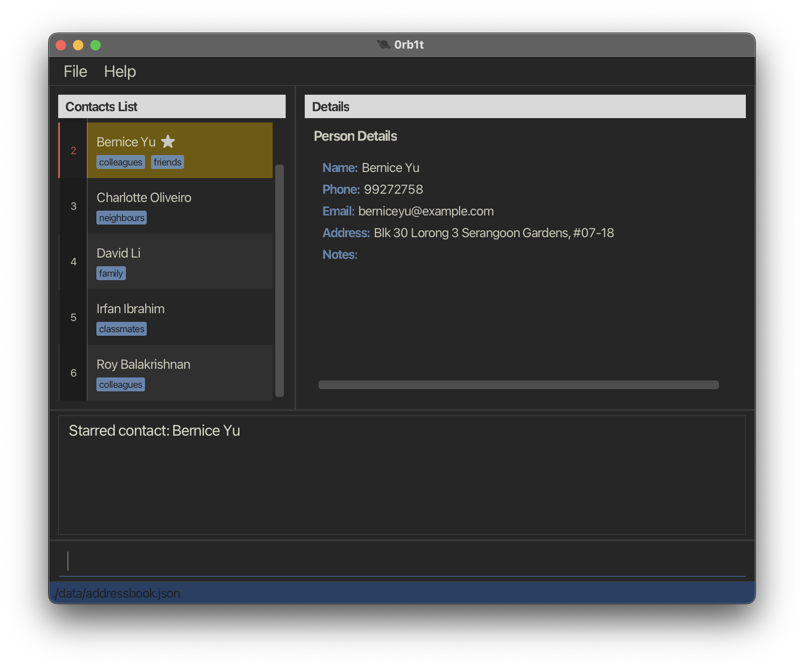

# 0rb1t User Guide

**0rb1t** is a desktop application designed for developers who prefer keyboard-driven workflows.

- It brings a **Vim-inspired interface** to contact and task management, so you never have to reach for the mouse.
- Built for developers who feel at home in Vim: 0rb1t lets you navigate, edit, and manage with the keybindings you already know.

The app is **written in Object-Oriented Programming (OOP) fashion**, based on a ~6 KLoC codebase with solid user and developer documentation.

For detailed documentation, see the [**0rb1t Product Website**](https://ay2526s2-cs2103t-t15-4.github.io/tp/).

This project is based on the AddressBook-Level3 project created by the [SE-EDU initiative](https://se-education.org/).

# Table of Contents

- [Command List](#command-list)
    - [Notes about the Command Format](#notes-about-the-command-format)
    - [Accessing Command History](#accessing-command-history)
    - [Adding Contacts](#adding-contacts)
    - [Adding Notes to Contacts](#adding-notes-to-contacts)
    - [Clearing 0rb1t](#clearing-0rb1t)
    - [Deleting Contacts](#deleting-contacts)
    - [Editing Contacts](#editing-contacts)
    - [Exiting 0rb1t](#exiting-0rb1t)
    - [Accessing Help in 0rb1t](#accessing-help-in-0rb1t)
    - [Listing Contacts](#listing-contacts)
    - [Sorting Contacts](#sorting-contacts)
    - [Starring Contacts](#starring-contacts)
    - [Listing Tags](#listing-tags)
    - [Undoing a Command](#undoing-a-command)
    - [Viewing Contacts](#viewing-contacts)
- [Storage](#storage)
    - [Saving the data](#saving-the-data)
    - [Editing the data file](#editing-the-data-file)
- [Tips and Examples](#tips-and-examples)
- [Frequently Asked Questions (FAQ)](#frequently-asked-questions-faq)
- [Known Issues](#known-issues)
- [Coming Soon](#coming-soon)
- [Command Summary](#command-summary)

## Quick Start

Follow these steps to get 0rb1t running on your computer:

1. **Ensure you have Java 17 or above installed.**
    - **Mac users:** Make sure you have the exact JDK version required.
2. **Download the latest `.jar` file** from [here](https://github.com/AY2526S2-CS2103T-T15-4/tp/releases/tag/v1.0.0).
3. **Copy the `.jar` file** to the folder you want to use as the home folder for 0rb1t.
4. **Open a terminal** and navigate to the folder containing the `.jar` file.
5. **Run the application** using the following command:

```
java -jar 0rb1t.jar
```
A GUI similar to the below should appear in a few seconds. Note how the app contains some sample data.



---

## Command List

### Notes about the Command Format

- Words in `UPPER_CASE` are parameters to be supplied by you.
  Example: in `:add n/NAME`, `NAME` can be used as `:add n/John Doe`.
- Items in square brackets are optional.
  Example: `n/NAME [t/TAG]` can be used as `n/John Doe t/friend` or `n/John Doe`.
- Items followed by `...` can be used multiple times (including zero times).
  Example: `[t/TAG]...` can be used as no tags, `t/friend`, or `t/friend t/family`.
- Parameters can appear in any order unless otherwise stated.
  Example: if a command accepts `n/NAME p/PHONE`, then `p/PHONE n/NAME` is also accepted.
- For commands that do not take additional parameters (such as `:help` and `:exit`), extra text is ignored.
  Example: `:help 123` is interpreted as `:help`.
- If you are using a PDF version of this guide, be careful when copying multi-line commands.
  Spaces around line breaks may be omitted when copied into the app.

### Accessing Command History

To navigate previously used commands, use the `UP` and `DOWN` arrow keys in the command box. `UP` to recall older commands, `DOWN` to recall newer commands.

Note: Navigating past the most recent command clears the command box. Up to 64 commands are stored.

Format: `UP` or `DOWN`

Expected: The command box will display the selected command from the history, depending on whether you press the `UP` or `DOWN` key.

### Adding Contacts

To add a contact, simply type `:add` followed by the details of the contact you wish to add. The parameters required are:

- The contact’s name, typed after `n/`.
- The contact’s phone number, typed after `p/`.
- The contact’s email, typed after `e/`.
- The contact’s house address, typed after `a/`.
- Any tags you wish to identify the contact with, typed after `t/`, and each additional tag after the first one separated by `t/`.

Note: All parameters are required except for tags. A contact can have up to 10 tags.

Note: Tags are automatically converted to lowercase when added. For example, `t/Friend` will be stored as `friend`.

Note: Adding more than 10 tags to a single contact is not allowed.

Format: `:add n/NAME p/PHONE e/EMAIL a/ADDRESS [t/TAG]...`

Examples:

`:add n/John Doe p/98765432 e/johnd@example.com a/John Street, Block 123, #01-01`

`:add n/Betsy Crowe t/friend e/betsycrowe@example.com a/Newgate Prison p/1234567 t/criminal`

Expected: The new contact will be added to 0rb1t, and it can be viewed in the main window.



### Adding Notes to Contacts

To add a note to a contact, type `:note` followed by the index of the contact and the note you wish to add.

Notes uses an append-only model, meaning each new note is added to the end of the existing list and individual notes cannot be deleted unless the contact itself is deleted.

Notes follow these constraints:
- Each contact can have up to 20 notes.
- Each note can be at most 200 characters long.
- Formatting-related special characters, such as escape sequences (\n, \t), quotation marks, backslashes, and markup like HTML or Markdown, are not interpreted.
- Notes are displayed exactly as entered.

Format: `:note <INDEX> note`

Examples: 

`:note 1 This is an important contact.`

`:note 5 Don't forget to follow up with him/her.`

Expected: The note will be added/appended to the contact in 0rb1t.



### Clearing 0rb1t

To clear the entire 0rb1t, type `:clear`. 0rb1t will ask you whether you wish to clear the entire 0rb1t (in case you mistyped). Typing `yes` will clear 0rb1t, while typing anything else will cancel the command.

Format: `:clear` + `yes`

Example:

`:clear`

_Are you sure you want to clear the entire 0rb1t?
Type 'yes' to confirm. Any other input will be taken as no._

`yes`

Expected: The entire 0rb1t will be cleared, and the sidebar will be empty.

### Deleting Contacts

To delete a contact, type `:delete` followed by the index of the contact you wish to delete. The index of each individual contact can be found at the sidebar.

Format: `:delete <INDEX>` + `yes`

Example:

`:delete 1`

_Are you sure you want to delete this contact?\
\<Contact details\>\
Type 'yes' to confirm. Any other input will be taken as no._

`yes`

Expected: The contact corresponding to the entered index will be deleted from 0rb1t. 0rb1t confirms that the chosen contact has been deleted, and shows the details of the contact deleted.

### Editing Contacts

To edit the details of a contact, type `:edit` followed by the index of the contact you wish to edit, 
then the field prefixes of the fields you wish to change, and then the new details. The fields that can be edited are:

- The contact’s name, typed after `n/`.
- The contact’s phone number, typed after `p/`.
- The contact’s email, typed after `e/`.
- The contact’s house address, typed after `a/`.
- Any tags you wish to identify the contact with, typed after `t/`, and each additional tag after the first one separated by `t/`.
- Any tags you wish to remove from the contact, typed after `dt/`, and each additional tag to be removed separated by `dt/`.

Note: If you wish to leave some fields unchanged, you do not have to include them in the `:edit` command.

Note: Every prefix must be followed by a non-empty value, except `dt/`. `dt/` without a tag value removes all tags from the 
contact, while `dt/<tag>` removes only the specified tag(s).

Note: Tags added with `t/` are automatically converted to lowercase before being stored.

Note: A contact can only have at most 10 tags after the edit is applied.

Format: `:edit <INDEX> [n/NAME] [p/PHONE] [e/EMAIL] [a/ADDRESS] [t/TAG] [dt/TAG] ...`

Examples:

`:edit 2 n/Adam Wong a/NUS PGP`

`:edit 5 p/13572468 t/school t/friend`

`:edit 1 e/jane_doe@example.com dt/school`

`:edit 3 dt/`

Expected: 0rb1t will show the updated details of the contact.

### Exiting 0rb1t

To exit the application, type `:exit` and the application will automatically close.

Format: `:exit`

Expected: 0rb1t will close. No goodbye message is shown.

### Accessing Help in 0rb1t

To find help content for using this application, type `:help`.


Format: `:help`

Expected: 0rb1t will open a separate help window, showing the link to the User Guide of 0rb1t.

### Listing Contacts

To list all contacts stored in 0rb1t, type `:list` and all contacts will appear on the sidebar.

Format: `:list [n/NAME] [p/PHONE] [e/EMAIL] [a/ADDRESS] [t/TAG]... [s/SORT]...`

Note: Items followed by `...` can be used multiple times (including zero times). Example: `[t/TAG]...` can be used as no tags, `t/friend`, or `t/friend t/family`.

Examples:

`:list`

`:list t/friends`

`:list t/friends t/colleagues`

Expected: 0rb1t will state that it listed all contacts, and the entire list will be made available in the sidebar.

If tags are added, all contacts with the relevant tags will be made available in the sidebar.



### Sorting Contacts

To sort contacts by specific fields, type `:list s/` followed by `+` or `-` for ascending or descending order, then the field prefix (`n` for name, `p` for phone).
Typing `s/*` ensures starred contacts are always at the top.

Format: `:list s/<+/- FIELD> [s/<+/- FIELD>]...`

Examples:

`:list s/+n`

`:list s/* s/-p`

Expected: The list of contacts will be sorted based on the parameter and in the order specified. If s/* was used, starred contacts will be pinned at the top.

### Starring Contacts

To star a contact, type `:star` followed by the index of the contact.
To unstar, type `:unstar` followed by the index of the contact.

Note: Starred contacts are indicated by a star next to the contact name. They are persisted and stored in the contact's data.

Format: `:star <INDEX>` or `:unstar <INDEX>`

Examples:

`:star 2`

`:unstar 7`

Expected: The contact at the given index will have a star icon next to their name, indicating that they are starred.



### Listing Tags

To display all the tags that you have added in 0rb1t, type `:tags` and all the tags you have added will be shown, with each tag separated by a comma.

Note: Tags are displayed in alphabetical order, and each tag is shown only once even if multiple contacts have the same tag. Tags are stored in lowercase, so entering `Friend` and `friend` results in the same tag: `friend`.

Format: `:tags`

Expected: 0rb1t will display all the tags that have been added to 0rb1t.

### Undoing a Command

To undo the last command that modified data, type `:undo`. This reverses the effect of the most recent mutating command (e.g., `:add`, `:delete`, `:edit`, `:clear`, `:note`, `:star`, `:unstar`).

Note: Only the most recent mutating command can be undone. You cannot undo more than once in a row, and non-mutating commands like `:list` or `:view` do not count as undoable actions.

Format: `:undo`

Expected: 0rb1t will reverse the last mutating command and display a success message. If there is nothing to undo, an error message will be shown.

### Viewing Contacts

To view the details of a contact, type `:view` followed by the index of the contact you wish to view.

Format: `:view <INDEX>`

Examples:

`:view 2`

`:view 10`

Expected: 0rb1t will state which contact is being shown by stating the name of the contact. The corresponding contact will be highlighted in the sidebar, and the contact details can be viewed in the main window.

## Storage

### Saving the data

All data in 0rb1t is saved to the hard disk automatically after any command that changes the data. There is no need to save manually.

### Editing the data file

All data is saved automatically as a JSON file [JAR file location]/data/addressbook.json.
Advanced users are welcome to update data directly by editing that data file.

Caution: If your changes to the data file make its format invalid, 0rb1t will discard all data and start with an empty data file at the next run. Hence, it is recommended to take a backup of the file before editing it.
Furthermore, certain edits can cause 0rb1t to behave in unexpected ways (e.g., if a value entered is outside the acceptable range). Therefore, edit the data file only if you are confident that you can update it correctly.

## Tips and Examples

- Use `:list n/<NAME>` to narrow down the right contact before any other action to avoid changing/deleting the wrong contact.

- Example:
`:list n/adam`
`:edit 1 p/12345678`
`:delete 1`

## Frequently Asked Questions (FAQ)

**Q**: How do I transfer my data to another computer?

**A**: Install the app on the other computer and overwrite the empty data file it creates with the file that contains the data of your previous AddressBook home folder.

## Known Issues

1. **When using multiple screens**, if you move the application to a secondary screen, and later switch to using only the primary screen, the GUI will open off-screen. The remedy is to delete the `preferences.json` file created by the application before running the application again.
2. **If you minimise the Help Window** and then run the `help` command (or use the `Help` menu, or the keyboard shortcut `F1`) again, the original Help Window will remain minimised, and no new Help Window will appear. The remedy is to manually restore the minimised Help Window.

## Coming Soon

The following enhancements are planned for future releases:

- Editing and deleting individual notes.
- Searching based on notes.
- Text autocomplete for commands, tags, and common field prefixes.
- Batch operations to apply a command to multiple contacts, e.g.`:delete 3 4 8` deletes contacts indexed 3, 4 and 8.

## Command Summary

| Command        | Format                                         | Description                                            | Example                                                                                              |
|----------------|------------------------------------------------|--------------------------------------------------------|------------------------------------------------------------------------------------------------------|
| Access History | `UP` or `DOWN`                                 | Navigates to previously used commands.                 | `UP` or `DOWN`                                                                                       |
| Add Contact    | `:add n/NAME p/PHONE e/EMAIL a/ADDRESS [t/TAG]...` | Adds a contact to 0rb1t.                               | `:add n/John Doe p/98765432 e/johnd@example.com a/311, Clementi Ave 2, #02-25 t/friends t/owesMoney` |
| Add Note       | `:note <INDEX> note`                           | Adds a note to the contact.                            | `:note 2 This is an important contact.`                                                              |
| Clear          | `:clear` + `yes`                               | Clears the entire 0rb1t.                               | `:clear`<br/>`...`<br/>`yes`                                                                         |
| Delete         | `:delete <INDEX>` + `yes`                      | Deletes a contact from 0rb1t.                          | `:delete 2`<br/>`...`<br/>`yes`                                                                      |
| Edit           | `:edit <INDEX> ...`                            | Edits a contact’s details in 0rb1t.                    | `:edit 3`                                                                                            |
| Exit           | `:exit`                                        | Exits 0rb1t.                                           | `:exit`                                                                                              |
| Star           | `:star <INDEX>` or `:unstar <INDEX>`            | Stars/Unstars a contact.                               | `:star 5`<br/>`:unstar 8`                                                                           |
| Help           | `:help`                                        | Opens the help page.                                   | `:help`                                                                                              |
| List Contacts  | `:list` or `:list <TAG>`                       | Lists all contacts stored in 0rb1t.                    | `:list`<br/>`:list t/friend`                                                                         |
| Sorting        | `:list s/<+/- FIELD>`                          | Sorts all contacts based on the field and the order.   | `:list s/+n`                                                                                         |
| List Tags      | `:tags`                                        | Lists all the tags used in 0rb1t.                      | `:tags`                                                                                              |
| Undo           | `:undo`                                        | Undoes the last mutating command.                      | `:undo`                                                                                              |
| View           | `:view <INDEX>`                                | Views a contact’s details in 0rb1t based on the index. | `:view 4`                                                                                            |
